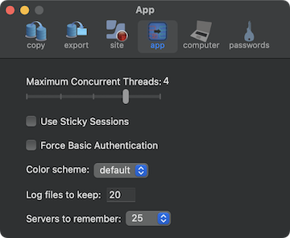
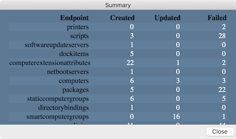
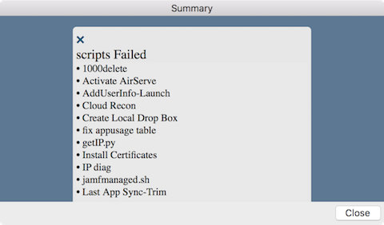

# Replicator

  
    


Download [Replicator](https://github.com/jamf/Replicator/releases/latest/download/Replicator.zip)</br>

A tool to synchronize objects between Jamf Pro servers. Export objects and save locally, then upload them to another Jamf Pro server. You can also use the tool to delete objects from a server.


By default the application will submit basic hardware, OS, and jamfCPR application usage to [TelemetryDeck](https://telemetrydeck.com). The data is sent anamously and used to aid in the development of the application. To opt out of data the sending of data click 'Opt out of analytics' at the bottom of the Settings --> app window.

Replicate items from one Jamf server, or XML file(s), to another.  If an object (based on name) exists on both source and destination, the destination object will be updated with values from the source server.
</br></br>

Username and password fields can be hidden/shown using the disclosure tringle on the left.


When replicating files be sure to open the 'raw' folder.
  
  
  Devices (computers and iOS), Groups, Policies, and Configuration Profiles can be targeted to a particular site.</br>
  
</br></br>

Servers can be removed from the (source/destination) list by holding down the option key while selecting the server.  A warning will be presented to verify the removal.</br>
  
</br></br>

**Limitations/requirements to be aware of:**

* Passwords can not be extracted through the API which impacts replicating distribution points, computer management account, account used for LDAP.  A password can be supplied for each service account, but credentials may need to be reset on the destination server for more complex configurations.
* Certificate used for LDAPS does not replicate.
* Icons associated with Mac App Store apps are not replicated as the API does not support it.
* Only AFP and SMB shares can be replicated.
* Patch management is not available through the API impacting smart groups dependent on patch management extension attributes.
* If endpoints (computers, policies, configuration profiles...) have duplicate names on the source server issues will arise if the app is used to update those items from the source to destination server.  As each item is migrited it will overwrite the previous item with the same name.
* Replicating smart/static groups with criteria containing groups will fail if the parent group tries to replicate before the group in the criteria.  Replicating groups several times should allow all the nested groups to replicate before the parent group.
* Institutional disk encryptions that contain the private key cannot be replicated.
* Approved System/Kernel Extension payloads do not replicate properly.  Display names are dropped and additional keys/values are added by the Jamf API that results in a corrupt profile and failure in profile deployment.
* Policies - The Software Update payload does not replicate.  Also, within the packages payload, setting for the distribution point will not replicate.
* Objects with trailing spaces in the name will replicate once but the process of uploading through the API removes those spaces.  This causes issues re-replicating those objects as the names no longer match.
* Users and usergroups used in policy limitations/exclusions do not replicate as the API does not provide that information.
* Packages <ul>
  <li>Only package metadata (display name, file name, size, ...) is replicated.  To replicate the actual package either use your browser, [Jamf Sync](https://github.com/jamf/JamfSync), or [jamfcpr](https://github.com/BIG-RAT/jamfcpr)</li>
  <li>The API allows for the creation of multiple packages, with different display names, to reference the same package file name.  The Jamf Pro console prevents this as there should be a one to one mapping.</li>
  </ul>
* Saving of objects whos name contains a : (colon) will be saved using a ; (semi-colon).
* Enabled state of mobile device applications is not handled in the API, as a result all replicated mobile device applications will be enabled on the destination server whether it is enabled or disabled on the source.
* Configuration Profiles -> Applications & Custom Settings -> External Applications settings will not replicate/export properly.  The form generated by the custom schema is not replicated/exported, rather the current settings from the form are replicated/exported.  The replicated profile will show the current setting for the external applicaton under the 'Upload' section within Application & Custom Settings.
* Apps from the Jamf App Catalog are not listed under the macapplications (classic API) endpoint. This may cause issues with other objects, like smart computer groups.
* __Patch Management:__ When replicating packages and patch policies may still be replicating after patch policy software titles are shown to have been completed. Better monitoring will appear in later updates.
* When replicating API roles a new (different) client ID is generated on the destination server.

<hr>

Be aware you may see the following alert requesting network access. Click allow to permit Replicator to connect to a server.

 

 <hr>

The Selective tab provides the ability to select a subset of (or all) items within a collection of objects.  For example you might only want to transfer 4 scripts from a larger pool of existing scripts.
  
  

Also, policies may have their dependencies checked/replicated using the Include Dependencies button.  Only 'top-level' dependencies are checked.  i.e. if the scope is being replicated and contains nested computer groups or groups assigned to a site that doesn't exist on the destination server the policy replication will likely fail.

Note: The ID of any object can be seen my hovering the mouse over the object.


Files exported using Replicator can be imported into another Jamf Pro server.  Be sure to open the 'raw' folder when importing.


</br></br>
**Important:** Trimmed XML files cannot be used as they are missing data required for the replication. 
</br></br>

**Preferences:**

* macOS Configuration Profiles 
* macOS Applications 
* Restrictions 
* Policies 
* Mobile Device Configuration Profiles 
* Mobile Device Applications 
* Static Computer Groups 
* Static Mobile Device Groups 
* Static User Groups 

In addition to scoping options the following are available:
* Policies can be copied in a disabled state
* Able to copy only items missing from the destination server - create only
* Able to copy only items currently on the destination server - update only<br>

** object name is used to determine whether or not it is on the destination server **


</br></br>
Options to export XML from the source server are also available.


</br>
* Raw Source XML gives you the XML from the source server before any modifications, like removing the id tag(s) and value(s).
* Trimmed Source XML give you the XML that is sent to the destination server.
* Save only saves the XML files and does not send them to the destination server.
* Save the object XML either with or without its scope.  Unchecked removes the scope.
* Note Save only and Raw Source XML options should not be selected when File Import is being used.
</br></br>

Options for replicating object(s) (searches, policies, and configuration profiles...) to a particular site can be set.


</br>
* Copying an object to another site either on the destination server or a site on the source server will create/update an object using the defined modifer to alter both the object name and name(s) of groups used in scoping. The variable $SITE may be used in place of entering a specific site name.

* Moving an object will not change any of the names. Moving an object to a site on the same server will remove the object from its present site (of NONE) to the new site. Use caution as to not unintentionally unscope configuration profiles from current objects. Moving objects to another server will leave teh object as is on source server and create a new object in the site on the destination server.
</br></br>

The number of concurrent API operations (from 1 to 5), sticky sessions (when available), color scheme, number of log files to retain, number of servers can be remembered, toggling debug mode, and toggling analytic settings can be set.


</br>
Migrated computers can show as managed by setting the management account.
</br></br>


</br>
Set a password for following replicated service accounts; bind, ldap, file share Read/Write, and file share Read-only.
</br></br>


</br>
Note, the same password will be applied if you have multiple binds, or ldap servers, or file shares coonfigured.  
</br></br>
**Migration Summary:**

* To get details on how many items were created/updated or failed to replicate type ⌘S, or select Show Summary under the File menu.
  
  
   
* Additional information about each count can be obtained by clicking on the number. For example, if we want to see a list of the 4 updated API clients, click on the 4.
  
  
  <br><br>
  
Information about successes/failures can be found in the log, located in 

```
~/Library/Containers/com.jamf.jamf-migrator/Data/Library/Logs/Replicator/<date>_<time>_migration.log
```

Logs can be quickly accessed using Command-L (⌘L) or selecting View --> Logs... from the menu bar.

More detailed logging can be performed by enabling 'Debug Mode' in Settings --> App.

If you have used Replicator and saved passwords you may see the following after launching a new version.

 
 
 If you'd like the new version to access existing credentials select the desired option.


**Important:**

* There are many dependencies between items, if they are not met transfers fail.  For example, if a policy is site specific the site must be replicated before the policy; if a distribution point has a building and/or department defined those need to replicate first...  If everything is replicated the order of sections is already taken care of, if you choose not to move some items that's where you can have issues.


**Note:** the app can also be used to clear out a Jamf server.  Typing the following after launching the app will set it into removal mode.  Items from the destination server are deleted once Go is clicked.

```
touch ~/Library/Containers/com.jamf.Replicator/Data/Library/Application\ Support/Replicator/delete
```

* You can also toggle the mode using Command-D (&#8984;D) or select Toggle Mode from View in the menu bar.<br><br>

## Running from the command line

Help is available by running:
```
/path/to/Replicator.app/Contents/MacOS/Replicator -help
```
Running the following in Terminal will export all objects (full XML) that can be replicated:
```
/path/to/Replicator.app/Contents/MacOS/Replicator -source your.jamfPro.fqdn -export -objects allobjects
```

In the event you have multiple entries in the keychain for a server you'll need to specify which username to use.  For example:
```
/path/to/Replicator.app/Contents/MacOS/Replicator  -source dev.jamfcloud.com -destination prod.jamfcloud.com -objects "categories,buildings" -migrate -sourceUser devadmin -destUser prodadmin
```

Before running an export via command line at least one export from the app must be manually run saving the source username and password or client ID and secret.<br>

To replicate object(s) using the command line, something like the following can be used:
```
/path/to/Replicator.app/Contents/MacOS/Replicator -source your.jamfPro.fqdn -destination dest.jamfPro.fqdn -objects categories,buildings -migrate
```
If importing files, the import folder must be selected in the UI before the command line can be successfully run.

To set an ldap id of 3 on jamf user accounts and force that id (also converts local accounts to ldap) use the following:
```
/path/to/Replicator.app/Contents/MacOS/Replicator -ldapid 3 -source /Users/admin/Desktop/export/raw -migrate -objects jamfusers
```
This can also be accomplished using the UI by launching Replicator from Terminal:  
```
/path/to/Replicator.app/Contents/MacOS/Replicator -ldapid 3
```
<br><br>
